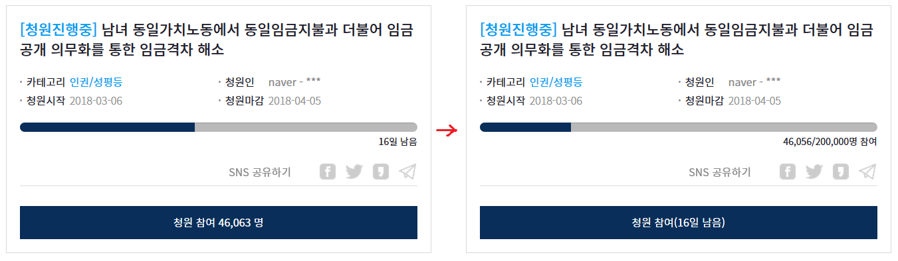

# wtf-bluehouse
청와대 청원 페이지 왜이렇게 생겼어

# 뭐야 이건

청와대 청원 페이지 디자인을 아래같이 바꿔줍니다.

# 설치

1. Greasemonkey나 Tampermonkey 확장기능을 먼저 설치합니다.
2. [wtf-bluehouse.user.js](wtf-bluehouse.user.js?raw=true) 스크립트를 설치합니다.
